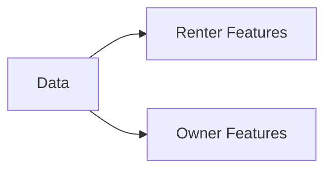

# AI4Good Hackathon 2025

## Overview

**Team Name:** Horizon  
**Project Name:** Horizon Affordability Index(TM)   
**Problem Case:** City and Tract-level Affordability Indexes - Develop a city-level and tract-level affordability index using housing, transportation, walkability, and income data.  
**Problem Solved:** [Summarize the problem and how your solution addresses it]  

## Team Members

| Role                         | Name                                                            |
| ---------------------------- | --------------------------------------------------------------- |
| Data Analyst / ML Engineer   | [Marion Forrest](https://www.linkedin.com/in/themarionforrest/) |
| Frontend Developer           | [Antony Malesevic](https://www.linkedin.com/in/antony-malesevic/)                                                                               |
| Project Manager / Researcher | [Aryan G](https://www.linkedin.com/in/aryan-gholinezhad/)       |

## How It Works

### Architecture

#### Features Engineered

Do a codebook table

#### Machines Learned

Do a diagram and explanation

#### Endpoints API'ed

Display Schemas

#### Ending the Front

Explain how the dashboard/index works

### Tech Stack

Frontend
- List

Backend
- FastAPI
- Pydantic

Other Tools
- Pandas & Numpy
- Scikit-Learn

## Design Considerations & Challenges Encountered

### Data Quality and Data Cleaning

Despite having **123** features at our disposal within the initial dataset, we chose to immediately exclude **45** features. The main driver behind this decision was the presence of temporal disparities between when certain collections of datapoints were recorded. Some data sets provided aggregated statistics on ranges such as 2017-2022 and 2020-2024, while others were recorded prior to 2020. It is in our semi-professional opinion that one should not attempt to make a predictive model of current trends (as we aimed to do) using *snapshots* and *aggregations* of data from so far in the past. In other words, we believe that an aggregated number from the 2017-2022 range could not provide accurate insight into a 2024-2025 trend. As such, we chose exclude data points from older collections and those with wide ranges.

>[!note]
>The CHAS dataset for the 2019-2024 window is not expected to release until late 2026.

## Next Steps

### Demographic Considerations

Allow users input demographic information to get an **Affordability Probability**. That being, the likelihood a household (or individual) with the given characteristics (ethnicity, number of children, etc.) would be able to afford to live in a given ==zip code==. This extension would allow city officials to identify and plan *more targeted* policy for specific demographic cohorts.
