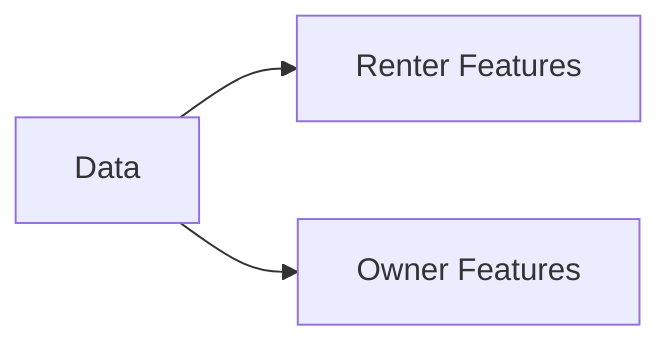

# AI4Good Hackathon 2025

## Overview

**Team Name:** Horizon  
**Project Name:** Horizon Affordability Index(TM)   
**Problem Case:** City and Tract-level Affordability Indexes - Develop a city-level and tract-level affordability index using housing, transportation, walkability, and income data.  
**Problem Solved:** [Summarize the problem and how your solution addresses it]  

## Team Members

| Role                                | Name                                                                |
| ----------------------------------- | ------------------------------------------------------------------- |
| Data Analyst / ML Engineer          | [Marion Forrest](https://www.linkedin.com/in/themarionforrest/)     |
| Frontend Developer / API Integrator | [Antony Malesevic](https://www.linkedin.com/in/antony-malesevic/)   |
| Project Manager / Researcher        | [Aryan Gholinezhad](https://www.linkedin.com/in/aryan-gholinezhad/) |

## How It Works

### Architecture

#### Features Engineered

| Name                                                           | Unit    | Description                                                                                                                                                |
| -------------------------------------------------------------- | ------- | ---------------------------------------------------------------------------------------------------------------------------------------------------------- |
| Public Transport Commute Rate                                  | Percent | The percentage of households that commute to work by public transportation.                                                                                |
| Private Vehicle Commute Rate                                   | Percent | The percentage of households that commute to work by a private vehicle (either alone or carpooled).                                                        |
| Walking and Cycling Commute Rate                               | Percent | The percentage of households that commute to work by walking or cycling.                                                                                   |
| Other Mobility Commute Rate                                    | Percent | The percentage of households that commute to work by any other means.                                                                                      |
| Proportion of Home Owners Not Cost Burdened (W)                | Percent | The percentage of households that are not Cost Burdened. This variant of the metric is specific to White, Non-Hispanic residents.                          |
| Proportion of Home Renters Not Cost Burdened (W)               | Percent | The percentage of households that are not Cost Burdened. This variant of the metric is specific to White, Non-Hispanic residents.                          |
| Proportion of Home Owners Not Cost Burdened (B)                | Percent | The percentage of households that are not Cost Burdened. This variant of the metric is specific to Black or African American, Non-Hispanic residents.      |
| Proportion of Home Renters Not Cost Burdened (B)               | Percent | The percentage of households that are not Cost Burdened. This variant of the metric is specific to Black or African American, Non-Hispanic residents.      |
| Proportion of Home Owners Not Cost Burdened (H)                | Percent | The percentage of households that are not Cost Burdened. This variant of the metric is specific to Hispanic residents.                                     |
| Proportion of Home Renters Not Cost Burdened (H)               | Percent | The percentage of households that are not Cost Burdened. This variant of the metric is specific to Hispanic residents.                                     |
| Proportion of Home Owners That Are Cost Burdened (W)           | Percent | The percentage of households that are Cost Burdened. This variant of the metric is specific to White, Non-Hispanic residents.                              |
| Proportion of Home Renters That Are Cost Burdened (W)          | Percent | The percentage of households that are Cost Burdened. This variant of the metric is specific to White, Non-Hispanic residents.                              |
| Proportion of Home Owners That Are Cost Burdened (B)           | Percent | The percentage of households that are Cost Burdened. This variant of the metric is specific to Black or African American, Non-Hispanic residents.          |
| Proportion of Home Renters That Are Cost Burdened (B)          | Percent | The percentage of households that are Cost Burdened. This variant of the metric is specific to Black or African American, Non-Hispanic residents.          |
| Proportion of Home Owners That Are Cost Burdened (H)           | Percent | The percentage of households that are Cost Burdened. This variant of the metric is specific to Hispanic residents.                                         |
| Proportion of Home Renters That Are Cost Burdened (H)          | Percent | The percentage of households that are Cost Burdened. This variant of the metric is specific to Hispanic residents.                                         |
| Proportion of Home Owners That Are Severely Cost Burdened (W)  | Percent | The percentage of households that are Severely Cost Burdened. This variant of the metric is specific to White, Non-Hispanic residents.                     |
| Proportion of Home Renters That Are Severely Cost Burdened (W) | Percent | The percentage of households that are Severely Cost Burdened. This variant of the metric is specific to White, Non-Hispanic residents.                     |
| Proportion of Home Owners That Are Severely Cost Burdened (B)  | Percent | The percentage of households that are Severely Cost Burdened. This variant of the metric is specific to Black or African American, Non-Hispanic residents. |
| Proportion of Home Renters That Are Severely Cost Burdened (B) | Percent | The percentage of households that are Severely Cost Burdened. This variant of the metric is specific to Black or African American, Non-Hispanic residents. |
| Proportion of Home Owners That Are Severely Cost Burdened (H)  | Percent | The percentage of households that are Severely Cost Burdened. This variant of the metric is specific to Hispanic residents.                                |
| Proportion of Home Renters That Are Severely Cost Burdened (H) | Percent | The percentage of households that are Severely Cost Burdened. This variant of the metric is specific to Hispanic residents.                                |
| Education Rate - No High School Diploma                        | Ratio   | The ratio of the number of adult residents without a high school diploma to the total number of households.                                                |
| Education Rate - High School Graduate                          | Ratio   | The ratio of the number of adult residents with a high school diploma to the total number of households.                                                   |
| Education Rate - Some College or Associate's Degree            | Ratio   | The ratio of the number of adult residents with some college education or an associate's degree to the total number of households.                         |
| Education Rate - Bachelor's Degree or Higher                   | Ratio   | The ratio of the number of adult residents with a bachelor's degree or higher to the total number of households.                                           |
| Proportion of Households at Income Level - Low                 | Percent | The percentage of households that fall under the Low Income Level category (Less than $25,000 per year).                                                   |
| Proportion of Households at Income Level - Middle              | Percent | The percentage of households that fall under the Middle Income Level category ($25,000 to $50,000 per year).                                               |
| Proportion of Households at Income Level - High                | Percent | The percentage of households that fall under the High Income Level category ($50,000 to $100,000 per year).                                                |
| Proportion of Households at Income Level - Very High           | Percent | The percentage of households that fall under the Very High Income Level category (More than $100,000 per year).                                            |
| Children to Adult Ratio                                        | Ratio   | The ratio of the number of children (age 0-19) to the number of adults (age 20 and over) in the region.                                                    |
| HUD Subsidization Rate                                         | Ratio   | The ratio of HUD subsidized housing units to the total number of occupied housing units.                                                                   |
| SNAP Subsidization Rate                                        | Ratio   | The ratio of households receiving SNAP benefits to the total number of occupied housing units.                                                             |
| Occupancy Rate                                                 | Percent | The percentage of housing units that are occupied.                                                                                                         |
| Overcrowding Rate                                              | Ratio   | The number of overcrowded housing units to the total number of occupied housing units.                                                                     |

#### Machines Learned

Do a diagram and explanation

#### Endpoints API'ed

Display Schemas

#### Ending the Front

Explain how the dashboard/index works

### Tech Stack

Frontend
- List

Backend
- FastAPI
- Pydantic

Other Tools
- Pandas & Numpy
- Scikit-Learn

## Design Considerations & Challenges Encountered

### Data Quality and Data Cleaning

Despite having **123** features at our disposal within the initial dataset, we chose to immediately exclude **45** features. The main driver behind this decision was the presence of temporal disparities between when certain collections of datapoints were recorded. Some data sets provided aggregated statistics on ranges such as 2017-2022 and 2020-2024, while others were recorded prior to 2020. It is in our semi-professional opinion that one should not attempt to make a predictive model of current trends (as we aimed to do) using *snapshots* and *aggregations* of data from so far in the past. In other words, we believe that an aggregated number from the 2017-2022 range could not provide accurate insight into a 2024-2025 trend. As such, we chose exclude data points from older collections and those with wide ranges.

>[!note]
>The CHAS dataset for the 2019-2024 window is not expected to release until late 2026.

## Next Steps

### Demographic Considerations

Allow users input demographic information to get an **Affordability Probability**. That being, the likelihood a household (or individual) with the given characteristics (ethnicity, number of children, etc.) would be able to afford to live in a given ==zip code==. This extension would allow city officials to identify and plan *more targeted* policy for specific demographic cohorts.
