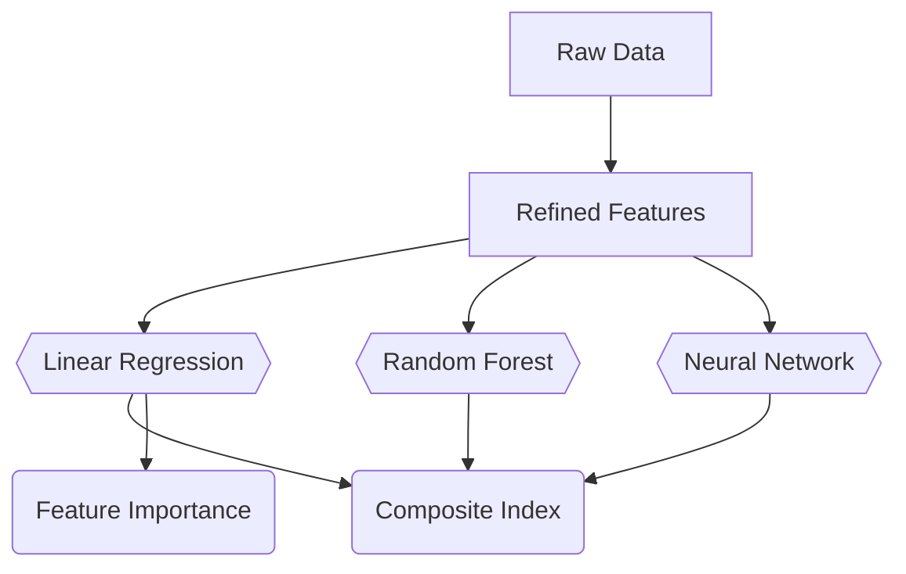

# AI4Good Hackathon 2025

## Overview

**Team Name:** Horizon  
**Project Name:** Horizon Affordability Index(TM)   
**Problem Case:** City and Tract-level Affordability Indexes - Develop a city-level and tract-level affordability index using housing, transportation, walkability, and income data.  
**Problem Solved:** We used an ensemble of machine learning models to compute a housing affordability score for a given zip code (or census tract) and designed an interactive dashboard you view an index of these scores.  

## Team Members

| Role                                | Name                                                                |
| ----------------------------------- | ------------------------------------------------------------------- |
| Data Analyst / ML Engineer          | [Marion Forrest](https://www.linkedin.com/in/themarionforrest/)     |
| Frontend Developer / API Integrator | [Antony Malesevic](https://www.linkedin.com/in/antony-malesevic/)   |
| Project Manager / Researcher        | [Aryan Gholinezhad](https://www.linkedin.com/in/aryan-gholinezhad/) |

## How It's Made

We used an ensemble of machine learning models to compute a housing affordability score for a given zip code (or census tract) and designed an interactive dashboard you view an index of these scores. Our main goal with this project was to provide city officials with a way to:

1) Compare neighborhoods in Jacksonville based on housing affordability
2) Identify the key characteristics that may be contributing to housing unaffordability in a region
3) View how those characteristics differ between neighborhoods.

We also wanted our index to be "backwards compatible" with other indexes so city officials could compare Jacksonville neighborhoods with those in other cities and states.

### Machines Learned

We use the combined outputs of three machine learning models to derived our index. We chose to use an ensemble of models for two main reasons. Firstly, we were inspired by how the credit scoring system has three main reporting parties. We liked the idea of having our index being derived from the "agreement" of three parties, such that if one model was suggesting a extremely low or high score, the other two can act to ground the number. Secondly, we figured my having different models with different architectures, each model would learn different ways of interpreting the data and provide us with a more wholistic picture underlying variance. 

### Features Engineered

In the below table are the data points each model takes in as input to represent a census tract.

| Name                                                           | Unit    | Description                                                                                                                                                |
| -------------------------------------------------------------- | ------- | ---------------------------------------------------------------------------------------------------------------------------------------------------------- |
| Public Transport Commute Rate                                  | Percent | The percentage of households that commute to work by public transportation.                                                                                |
| Private Vehicle Commute Rate                                   | Percent | The percentage of households that commute to work by a private vehicle (either alone or carpooled).                                                        |
| Walking and Cycling Commute Rate                               | Percent | The percentage of households that commute to work by walking or cycling.                                                                                   |
| Other Mobility Commute Rate                                    | Percent | The percentage of households that commute to work by any other means.                                                                                      |
| Proportion of Home Owners Not Cost Burdened (W)                | Percent | The percentage of households that are not Cost Burdened. This variant of the metric is specific to White, Non-Hispanic residents.                          |
| Proportion of Home Renters Not Cost Burdened (W)               | Percent | The percentage of households that are not Cost Burdened. This variant of the metric is specific to White, Non-Hispanic residents.                          |
| Proportion of Home Owners Not Cost Burdened (B)                | Percent | The percentage of households that are not Cost Burdened. This variant of the metric is specific to Black or African American, Non-Hispanic residents.      |
| Proportion of Home Renters Not Cost Burdened (B)               | Percent | The percentage of households that are not Cost Burdened. This variant of the metric is specific to Black or African American, Non-Hispanic residents.      |
| Proportion of Home Owners Not Cost Burdened (H)                | Percent | The percentage of households that are not Cost Burdened. This variant of the metric is specific to Hispanic residents.                                     |
| Proportion of Home Renters Not Cost Burdened (H)               | Percent | The percentage of households that are not Cost Burdened. This variant of the metric is specific to Hispanic residents.                                     |
| Proportion of Home Owners That Are Cost Burdened (W)           | Percent | The percentage of households that are Cost Burdened. This variant of the metric is specific to White, Non-Hispanic residents.                              |
| Proportion of Home Renters That Are Cost Burdened (W)          | Percent | The percentage of households that are Cost Burdened. This variant of the metric is specific to White, Non-Hispanic residents.                              |
| Proportion of Home Owners That Are Cost Burdened (B)           | Percent | The percentage of households that are Cost Burdened. This variant of the metric is specific to Black or African American, Non-Hispanic residents.          |
| Proportion of Home Renters That Are Cost Burdened (B)          | Percent | The percentage of households that are Cost Burdened. This variant of the metric is specific to Black or African American, Non-Hispanic residents.          |
| Proportion of Home Owners That Are Cost Burdened (H)           | Percent | The percentage of households that are Cost Burdened. This variant of the metric is specific to Hispanic residents.                                         |
| Proportion of Home Renters That Are Cost Burdened (H)          | Percent | The percentage of households that are Cost Burdened. This variant of the metric is specific to Hispanic residents.                                         |
| Proportion of Home Owners That Are Severely Cost Burdened (W)  | Percent | The percentage of households that are Severely Cost Burdened. This variant of the metric is specific to White, Non-Hispanic residents.                     |
| Proportion of Home Renters That Are Severely Cost Burdened (W) | Percent | The percentage of households that are Severely Cost Burdened. This variant of the metric is specific to White, Non-Hispanic residents.                     |
| Proportion of Home Owners That Are Severely Cost Burdened (B)  | Percent | The percentage of households that are Severely Cost Burdened. This variant of the metric is specific to Black or African American, Non-Hispanic residents. |
| Proportion of Home Renters That Are Severely Cost Burdened (B) | Percent | The percentage of households that are Severely Cost Burdened. This variant of the metric is specific to Black or African American, Non-Hispanic residents. |
| Proportion of Home Owners That Are Severely Cost Burdened (H)  | Percent | The percentage of households that are Severely Cost Burdened. This variant of the metric is specific to Hispanic residents.                                |
| Proportion of Home Renters That Are Severely Cost Burdened (H) | Percent | The percentage of households that are Severely Cost Burdened. This variant of the metric is specific to Hispanic residents.                                |
| Education Rate - No High School Diploma                        | Ratio   | The ratio of the number of adult residents without a high school diploma to the total number of households.                                                |
| Education Rate - High School Graduate                          | Ratio   | The ratio of the number of adult residents with a high school diploma to the total number of households.                                                   |
| Education Rate - Some College or Associate's Degree            | Ratio   | The ratio of the number of adult residents with some college education or an associate's degree to the total number of households.                         |
| Education Rate - Bachelor's Degree or Higher                   | Ratio   | The ratio of the number of adult residents with a bachelor's degree or higher to the total number of households.                                           |
| Proportion of Households at Income Level - Low                 | Percent | The percentage of households that fall under the Low Income Level category (Less than $25,000 per year).                                                   |
| Proportion of Households at Income Level - Middle              | Percent | The percentage of households that fall under the Middle Income Level category ($25,000 to $50,000 per year).                                               |
| Proportion of Households at Income Level - High                | Percent | The percentage of households that fall under the High Income Level category ($50,000 to $100,000 per year).                                                |
| Proportion of Households at Income Level - Very High           | Percent | The percentage of households that fall under the Very High Income Level category (More than $100,000 per year).                                            |
| Children to Adult Ratio                                        | Ratio   | The ratio of the number of children (age 0-19) to the number of adults (age 20 and over) in the region.                                                    |
| HUD Subsidization Rate                                         | Ratio   | The ratio of HUD subsidized housing units to the total number of occupied housing units.                                                                   |
| SNAP Subsidization Rate                                        | Ratio   | The ratio of households receiving SNAP benefits to the total number of occupied housing units.                                                             |
| Occupancy Rate                                                 | Percent | The percentage of housing units that are occupied.                                                                                                         |
| Overcrowding Rate                                              | Ratio   | The number of overcrowded housing units to the total number of occupied housing units.                                                                     |

### Boards Dashed

Our dashboard provides users with three main functionalities

1. **Viewing HAI Scores:** The dashboard allows users to type in a zip code, or visually select it on a map, to view the zip's composite HAI score along with the factors influencing the score.
2. **Comparing Scores**: The user can optionally select two zip codes at the same time to view their respective metrics side by side. This allows users to see which regions differ and understand how and why they differ. Additionally, an [H+T](https://htaindex.cnt.org/fact-sheets/?lat=30.326472&lng=-81.65535&focus=place&gid=4828#fs) equivalent HAI score is provided to allow users to compare Jacksonville to regions not represented in our data set.  
3. **Brainstorm Policy**: The use can also open a side pane where can converse with a housing affordability policy agent. We provided the agent with a variety of research papers to keep it informed and up to date while assisting users in planning public policy.

### Tech Stack

Frontend
- Vite
- React

Backend
- FastAPI
- Pydantic

Other Tools
- Pandas & Numpy
- Scikit-Learn

## Challenges Encountered

- **No Time-Series or Sequential Data**: We originally want to do trend analysis using a transformer for our project, but the data did not support that so we had to pivot our approach and settled on a comparison tool.

## Next Steps

1. **Policy Adjustment Simulation**: Allow users to simulate implementing different housing policies to view their predicted impact on a neighborhood.
